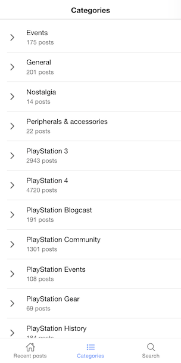

# A Wordpress app based on Ionic 6 & React

This is a simple app built on top of Ionic 6 & React for the frontend and Wordpress as a backend. 

Live preview 
https://wp-ionic6-react.netlify.app/

(you might want to enable toggle device toolbar in the Developer Tools of the browser to see how it looks in a smartphone)

Please support this project by simply putting a Github star ⭐  
Share this library with friends on Twitter and everywhere else you can. 🙏

Some screenshots :) 

